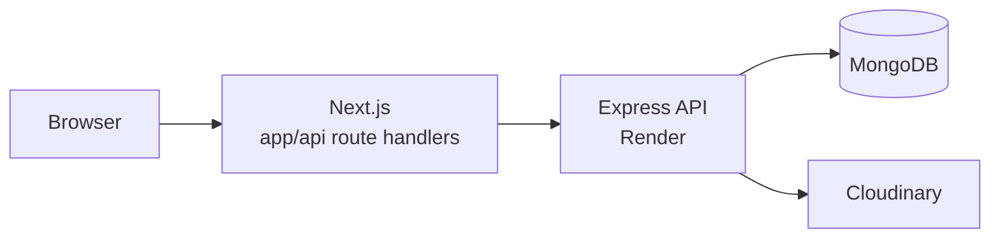

<h1 align="center">DiscoveryUA</h1>

<!--  -->
<p align="center">
  
</p>

<p align="center">
  <b>Discover Ukraine's most beautiful nature spots.</b><br />
  Browse real places, share your own finds and read honest reviews from fellow travellers.
</p>

<p align="center">
  
  
  
  
  
</p>

<p align="center">
  <a href="https://final-team-project-fs.vercel.app/"></a>
  <a href="https://final-team-project-bs.onrender.com/api-docs/"></a>
  <a href="https://github.com/AntoniiViazovskyi/final-team-project-bs"></a>
</p>

## Table of contents

1. [About the project](#about-the-project)
2. [Quick start](#quick-start)
3. [Screenshots](#screenshots)
4. [Features](#features)
5. [Tech stack](#tech-stack)
6. [Pages](#pages)
7. [How it works](#how-it-works)
8. [Responsive design and performance](#responsive-design-and-performance)
9. [Getting started](#getting-started)
10. [Project structure](#project-structure)
11. [Troubleshooting](#troubleshooting)
12. [Deployment](#deployment)
13. [Our team](#our-team)

## About the project

|                  |                                                                                                                                                |
| ---------------- | ---------------------------------------------------------------------------------------------------------------------------------------------- |
| **The problem**  | Great natural places in Ukraine are scattered across blogs, chats and social posts, so they are hard to find and hard to trust.                |
| **The solution** | **DiscoveryUA** puts them in one catalogue with real photos, filters and reviews. Anyone can add a place, so the map grows with the community. |

This repository is the **frontend**. It talks to the [DiscoveryUA backend](https://github.com/AntoniiViazovskyi/final-team-project-bs) through its own server-side API layer.

**Try it:** https://final-team-project-fs.vercel.app/

<p align="right"><a href="#discoveryua">↑ Back to top</a></p>

## Quick start

```bash
git clone https://github.com/AntoniiViazovskyi/final-team-project-fs.git
cd final-team-project-fs
npm install
cp .env.template .env.local   # then set BACKEND_ORIGIN
npm run dev
```

Open http://localhost:3000. You can use the hosted backend (`https://final-team-project-bs.onrender.com`) as `BACKEND_ORIGIN` to start without running anything else.

## Features

**For travellers**

- Search the catalogue by name, and filter by region and location type.
- Sort places by popularity, rating or newest first.
- Open any place to see its photo, description, author and reviews.
- Read the latest reviews and popular places on the home page.

**For contributors**

- Register, log in and manage a personal profile.
- Share a new place with a photo, and edit it later.
- Leave a rating and a review for any place. New reviews go through moderation before they appear.
- Visit other travellers' public profiles and see the places they published.

## Tech stack

<p align="center">
  
</p>

| Area             | Technology                            | Purpose                                    |
| ---------------- | ------------------------------------- | ------------------------------------------ |
| Framework        | Next.js 15 (App Router)               | Routing, server components, route handlers |
| UI               | React 19 with React Compiler          | Components                                 |
| Language         | TypeScript                            | Type safety                                |
| Styling          | CSS Modules, modern-normalize         | Scoped, mobile-first styles                |
| Server state     | TanStack Query                        | Fetching, caching, loading states          |
| Client state     | Zustand                               | Authentication state                       |
| Forms            | Formik + Yup                          | Forms and validation                       |
| HTTP             | Axios                                 | Requests to the internal API               |
| Sliders          | Swiper                                | Popular locations and reviews              |
| Feedback         | react-hot-toast, react-loader-spinner | Notifications and loaders                  |
| Pagination       | react-paginate                        | Catalogue pagination                       |
| Fonts and images | next/font (Montserrat), next/image    | Optimized assets                           |

## Pages

| Route                          | Access          | Description                                              |
| ------------------------------ | --------------- | -------------------------------------------------------- |
| `/`                            | Public          | Hero with search, advantages, popular locations, reviews |
| `/locations`                   | Public          | Catalogue with search, filters, sorting and "Show more"  |
| `/locations/[locationId]`      | Public          | Location details and reviews                             |
| `/locations/add`               | Private         | Create a new location                                    |
| `/locations/[locationId]/edit` | Private, author | Edit a location                                          |
| `/profile`                     | Private         | Redirects to your own profile                            |
| `/profile/[userId]`            | Public          | A user's profile and published locations                 |
| `/login`, `/register`          | Guests only     | Authentication                                           |

Modal windows (login prompt, add review, logout confirmation) open on parallel routes. The app also has custom **error**, **404** and **loading** pages.

## How it works

The browser never talks to the backend directly. Every request goes through the Next.js route handlers in `app/api`, which forward it to the Express API and pass the session cookies along.



<p align="right"><a href="#discoveryua">↑ Back to top</a></p>

## Responsive design and performance

The layout is built **mobile-first** with `min-width` media queries.

| Device  | Width                                   |
| ------- | --------------------------------------- |
| Mobile  | Fluid from 320 px, adaptive from 375 px |
| Tablet  | From 768 px                             |
| Desktop | From 1440 px                            |

## Getting started

### Prerequisites

- Node.js 20 or newer (24.x recommended, see `.nvmrc`)
- npm
- The [DiscoveryUA backend](https://github.com/AntoniiViazovskyi/final-team-project-bs), running locally or deployed

### Installation

```bash
git clone https://github.com/AntoniiViazovskyi/final-team-project-fs.git
cd final-team-project-fs
npm install
cp .env.template .env.local
npm run dev
```

### Environment variables

| Variable              | Description                                                            | Example                                      |
| --------------------- | ---------------------------------------------------------------------- | -------------------------------------------- |
| `BACKEND_ORIGIN`      | Origin of the Express backend, without `/api`. Used only on the server | `https://final-team-project-bs.onrender.com` |
| `NEXT_PUBLIC_APP_URL` | Public URL of this app (canonical URLs, Open Graph, sitemap)           | `http://localhost:3000`                      |

> [!WARNING]
> Never commit `.env.local`. Only `.env.template` is tracked.

### Scripts

| Command             | Description                   |
| ------------------- | ----------------------------- |
| `npm run dev`       | Start the development server  |
| `npm run build`     | Create a production build     |
| `npm start`         | Run the production build      |
| `npm run lint`      | Check code with ESLint        |
| `npm run lint:fix`  | Fix lint issues automatically |
| `npm run typecheck` | Check TypeScript types        |

## Project structure

```text
app/
├── (auth-routes)/  # login, register
├── (private)/      # pages that need a session
├── (public)/       # pages for everyone
├── @modal/         # parallel routes for modal windows
├── api/            # route handlers that forward requests to the backend
├── error.tsx       # global error page
├── not-found.tsx   # 404 page
└── loading.tsx     # global loader
components/         # UI components, each with its own CSS Module
lib/api/            # Axios clients for the browser and the server
lib/store/          # Zustand stores
types/              # shared TypeScript types
public/             # static assets and the SVG icon sprite
```

## Troubleshooting

| Problem                                           | Fix                                                                                             |
| ------------------------------------------------- | ----------------------------------------------------------------------------------------------- |
| Pages load with spinners for a long time at first | If the backend sleeps on a free plan, the first request wakes it. Wait a few seconds and reload |
| `Backend is not configured` (503)                 | Set `BACKEND_ORIGIN` in `.env.local` and restart `npm run dev`                                  |
| `npm run typecheck` fails on a fresh clone        | Run `npm run dev` or `npm run build` once. Next.js generates `next-env.d.ts`                    |
| Location photos don't load                        | Check that the image host is allowed in `images.remotePatterns` in `next.config.ts`             |

## Deployment

The frontend is deployed on **Vercel**: https://final-team-project-fs.vercel.app/

Set these environment variables in the Vercel project settings:

- `BACKEND_ORIGIN` — URL of the deployed backend
- `NEXT_PUBLIC_APP_URL` — URL of the deployed frontend

## Our team

Built by a team of 12. Each member owned one frontend area, one backend endpoint and the matching route handler.

| Member                 | Role         | Frontend                                                            | Route handlers                                       | Backend                                                        |
| ---------------------- | ------------ | ------------------------------------------------------------------- | ---------------------------------------------------- | -------------------------------------------------------------- |
| **Antonii Viazovskyi** | Team Lead    | `RegistrationForm`, `AuthNav`                                       | `auth/register`                                      | Project setup, `POST /auth/register`                           |
| **Tetiana Lapa**       | Scrum Master | `LoginForm`, `AuthPromptModal`                                      | `auth/login`                                         | `POST /auth/login`, image upload                               |
| **Yurii Ivanets**      | Developer    | `Header`, `ConfirmationModal`                                       | `auth/logout`, `auth/refresh`                        | `POST /auth/logout`, session refresh, authorization middleware |
| **Oleh Babiichyk**     | Developer    | `Layout`, `Footer`, home page assembly                              | `users/me`                                           | `GET /users/me`                                                |
| **Dima Semenovych**    | Developer    | `ProfileInfo`, `ProfilePlaceholder`, profile pages                  | `users/[userId]`                                     | `GET /users/:userId`                                           |
| **Mariia Zagoruiko**   | Developer    | `LocationCard`, `LocationsGrid`, catalogue page                     | `users/[userId]/locations`                           | `GET /users/:userId/locations`                                 |
| **Yuliya Zakrepa**     | Developer    | `FilterPanel`, `HeroBlock`                                          | `categories/regions`, `categories/types`             | `GET /categories/regions`, `GET /categories/types`             |
| **Tetiana Markina**    | Developer    | `LocationGallery`, `LocationDescription`                            | `locations/[locationId]`                             | `GET /locations/:locationId`                                   |
| **Iryna Viust**        | Developer    | `LocationInfoBlock`, `PopularLocationsBlock`, location details page | `locations` (GET)                                    | `GET /locations` (pagination, region, type, search, sort)      |
| **Ihor Bugaichuk**     | Developer    | `AddReviewModal`, `AddReviewForm`                                   | `feedbacks` (POST)                                   | `POST /feedbacks`                                              |
| **Ksenia Sereda**      | Developer    | `ReviewsBlock`, `ReviewsSection`                                    | `feedbacks` (GET)                                    | `GET /feedbacks` with pagination                               |
| **Maria Khomynets**    | Developer    | `LocationForm`, `AdvantagesBlock`, create and edit pages            | `locations` (POST), `locations/[locationId]` (PATCH) | `POST /locations`, `PATCH /locations/:locationId`              |

The backend lives in [final-team-project-bs](https://github.com/AntoniiViazovskyi/final-team-project-bs).

<p align="right"><a href="#discoveryua">↑ Back to top</a></p>
